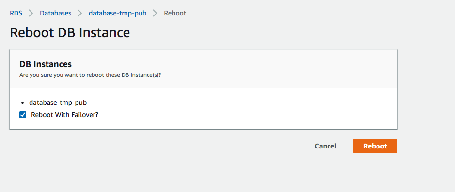

# Setup

## Install into a virtual python(3) env
```
# Python 3.x required
$ python -m venv venv
$ source venv/bin/activate
$ pip install -r requirements.txt
```
## Initiate testing database
This script is run to create the db and table to support `failover_test.py`.
Each time this is run it drops the DB and recreates.
```
./create_failover_sync_db.py
```

# Usage

This script simply inserts *hearbeat* records into a database until the connection fails.
It then continues to check the connection until it comes back (db failover finishes)
At that it outputs a summary of the event such as this:
```bash
========================================
Total Db connection attempts: 64
Successful Db connections: 33
Failed Db connections: 31
failure_start_time: Mon Sep 16 08:35:56 2019
failure_end_time: Mon Sep 16 08:36:42 2019
failure condition duration: 46 seconds
Last inserted sync record id on initial primary db node: 30
Pre-failure Db node hostname: ip-10-3-0-154
Post-failure Db node hostname: ip-10-3-2-182
Newest 5 sync records in current primary db node:
[ {'created': 1568648154, 'index_id': 30, 'test_run_id': 'test_run_0'},
  {'created': 1568648154, 'index_id': 29, 'test_run_id': 'test_run_0'},
  {'created': 1568648153, 'index_id': 28, 'test_run_id': 'test_run_0'},
  {'created': 1568648153, 'index_id': 27, 'test_run_id': 'test_run_0'},
  {'created': 1568648152, 'index_id': 26, 'test_run_id': 'test_run_0'}]
```

This script will start executing a 'heartbeat' query to the given MySQL database.
When there is a connection disruption, it will continue to try connections every sec.
When connectivity returns, it will stop and report the total time the db was not accessible.
This can be used measure the amount of time required for Failover in Db clusters with such capability

## Workflow
1. Execute this script
2. Take the action on you Db to initiate fail over workflow.

```bash
$ ./failover_test.py --test_run_id test_run_0
RDS Endpoint [localhost]:

  ... # you are prompted for all required db connection metadata and then the test will start

Connection succeeded at Mon Sep 16 08:17:18 2019
Test starting, initial Db node hostname: sam.mac.local
Insert succeeded at Mon Sep 16 08:17:18 2019 test_run_id: test_run_0, index_id:1
Insert succeeded at Mon Sep 16 08:17:19 2019 test_run_id: test_run_0, index_id:2
  ...

```

## Notes

### SSL connections
SSL connections to MySql is supported.  Simple answer `y` when prompted then supply the path the the cert file.
For instance if you are connecting to AWS RDS.
```bash
$ wget https://s3.amazonaws.com/rds-downloads/rds-combined-ca-bundle.pem
$ ./failover_test.py
# provide ./rds-combined-ca-bundle.pem for the SSL cert path when prompted
```

### Setting up on amazon linux2
```bash
$ sudo yum install -y python3-pip python3 python3-setuptools git -y

$ python3 --version
Python 3.7.4

$ git clone https://github.com/samkeen/db_test_meter.git

$ cd db_test_meter
```
Now simply follow ***Setup*** instructions above

### Example test run

Notice in this monitored event, we see the physical db node has changed (`ip-10-3-0-154` vs `ip-10-3-2-182`)
```
Pre-failure Db node hostname: ip-10-3-0-154
Post-failure Db node hostname: ip-10-3-2-182
```
We also see it has all the records of the previous db node (`test_run_id: 30`)
```
Last inserted sync record id on initial primary db node: 30
  ...
Newest 5 sync records in current primary db node:
[ {'created': 1568648154, 'index_id': 30, 'test_run_id': 'test_run_0'},
  {'created': 1568648154, 'index_id': 29, 'test_run_id': 'test_run_0'},
  ...
```

In this case we are testing an AWS RDS instance with Multi-AZ configured.  The failover _event_ is simply rebooting the 
instance with the _Reboot with Failover_ checkbox checked.



```bash
# First activate your virtual Python env
$ source venv/bin/activate

# Then create the db/table to be used by failover_test.py
$(venv) ./create_failover_sync_db.py
This will destroy and recreate sync database and tracking table
enter y to continue, n to exit [n]: y
Db Endpoint [localhost]: database-tmp-pub.abcdabcdabcd.us-west-2.rds.amazonaws.com
Db port [3306]:
Db User [root]: admin
Password for Db user:
Connecting over SSL (y/n) [y]: n
/Users/samkeen/Projects/db_test_meter/venv/lib/python3.7/site-packages/pymysql/cursors.py:329: Warning: (1008, "Can't drop database 'db_test_meter'; database doesn't exist")
  self._do_get_result()
Database db_test_meter created
Table db_test_meter.db_sync created

# Then start the test, and initiate the failover event
$(venv) ./failover_test.py --test_run_id test_run_0
Db Endpoint [localhost]: database-tmp-pub.abcdabcdabcd.us-west-2.rds.amazonaws.com
Db port [3306]:
Db User [root]: admin
Password for Db user:
Connecting over SSL (y/n) [y]: n
Connection succeeded at Mon Sep 16 08:35:38 2019
Test starting, initial Db node hostname: ip-10-3-0-154
Insert succeeded at Mon Sep 16 08:35:38 2019 test_run_id: test_run_0, index_id:1
Insert succeeded at Mon Sep 16 08:35:38 2019 test_run_id: test_run_0, index_id:2
Insert succeeded at Mon Sep 16 08:35:39 2019 test_run_id: test_run_0, index_id:3
Insert succeeded at Mon Sep 16 08:35:39 2019 test_run_id: test_run_0, index_id:4
Insert succeeded at Mon Sep 16 08:35:40 2019 test_run_id: test_run_0, index_id:5
Insert succeeded at Mon Sep 16 08:35:41 2019 test_run_id: test_run_0, index_id:6
Insert succeeded at Mon Sep 16 08:35:41 2019 test_run_id: test_run_0, index_id:7
Insert succeeded at Mon Sep 16 08:35:42 2019 test_run_id: test_run_0, index_id:8
Insert succeeded at Mon Sep 16 08:35:42 2019 test_run_id: test_run_0, index_id:9
Insert succeeded at Mon Sep 16 08:35:43 2019 test_run_id: test_run_0, index_id:10
Insert succeeded at Mon Sep 16 08:35:43 2019 test_run_id: test_run_0, index_id:11
Insert succeeded at Mon Sep 16 08:35:44 2019 test_run_id: test_run_0, index_id:12
Insert succeeded at Mon Sep 16 08:35:44 2019 test_run_id: test_run_0, index_id:13
Insert succeeded at Mon Sep 16 08:35:45 2019 test_run_id: test_run_0, index_id:14
Insert succeeded at Mon Sep 16 08:35:45 2019 test_run_id: test_run_0, index_id:15
Insert succeeded at Mon Sep 16 08:35:46 2019 test_run_id: test_run_0, index_id:16
Insert succeeded at Mon Sep 16 08:35:47 2019 test_run_id: test_run_0, index_id:17
Insert succeeded at Mon Sep 16 08:35:47 2019 test_run_id: test_run_0, index_id:18
Insert succeeded at Mon Sep 16 08:35:48 2019 test_run_id: test_run_0, index_id:19
Insert succeeded at Mon Sep 16 08:35:48 2019 test_run_id: test_run_0, index_id:20
Insert succeeded at Mon Sep 16 08:35:49 2019 test_run_id: test_run_0, index_id:21
Insert succeeded at Mon Sep 16 08:35:49 2019 test_run_id: test_run_0, index_id:22
Insert succeeded at Mon Sep 16 08:35:50 2019 test_run_id: test_run_0, index_id:23
Insert succeeded at Mon Sep 16 08:35:50 2019 test_run_id: test_run_0, index_id:24
Insert succeeded at Mon Sep 16 08:35:51 2019 test_run_id: test_run_0, index_id:25
Insert succeeded at Mon Sep 16 08:35:52 2019 test_run_id: test_run_0, index_id:26
Insert succeeded at Mon Sep 16 08:35:52 2019 test_run_id: test_run_0, index_id:27
Insert succeeded at Mon Sep 16 08:35:53 2019 test_run_id: test_run_0, index_id:28
Insert succeeded at Mon Sep 16 08:35:53 2019 test_run_id: test_run_0, index_id:29
Insert succeeded at Mon Sep 16 08:35:54 2019 test_run_id: test_run_0, index_id:30
Insert succeeded at Mon Sep 16 08:35:54 2019 test_run_id: test_run_0, index_id:31
(2013, 'Lost connection to MySQL server during query (timed out)')
There was an error: Db Connection failed
(2003, "Can't connect to MySQL server on 'database-tmp-pub.abcdabcdabcd.us-west-2.rds.amazonaws.com' (timed out)")
There was an error: Db Connection failed
(2003, "Can't connect to MySQL server on 'database-tmp-pub.abcdabcdabcd.us-west-2.rds.amazonaws.com' (timed out)")
There was an error: Db Connection failed
(2003, "Can't connect to MySQL server on 'database-tmp-pub.abcdabcdabcd.us-west-2.rds.amazonaws.com' (timed out)")
There was an error: Db Connection failed
(2003, "Can't connect to MySQL server on 'database-tmp-pub.abcdabcdabcd.us-west-2.rds.amazonaws.com' (timed out)")
There was an error: Db Connection failed
(2003, "Can't connect to MySQL server on 'database-tmp-pub.abcdabcdabcd.us-west-2.rds.amazonaws.com' (timed out)")
There was an error: Db Connection failed
(2003, "Can't connect to MySQL server on 'database-tmp-pub.abcdabcdabcd.us-west-2.rds.amazonaws.com' (timed out)")
There was an error: Db Connection failed
(2003, "Can't connect to MySQL server on 'database-tmp-pub.abcdabcdabcd.us-west-2.rds.amazonaws.com' (timed out)")
There was an error: Db Connection failed
(2003, "Can't connect to MySQL server on 'database-tmp-pub.abcdabcdabcd.us-west-2.rds.amazonaws.com' (timed out)")
There was an error: Db Connection failed
(2003, "Can't connect to MySQL server on 'database-tmp-pub.abcdabcdabcd.us-west-2.rds.amazonaws.com' (timed out)")
There was an error: Db Connection failed
(2003, "Can't connect to MySQL server on 'database-tmp-pub.abcdabcdabcd.us-west-2.rds.amazonaws.com' (timed out)")
There was an error: Db Connection failed
(2003, "Can't connect to MySQL server on 'database-tmp-pub.abcdabcdabcd.us-west-2.rds.amazonaws.com' (timed out)")
There was an error: Db Connection failed
(2003, "Can't connect to MySQL server on 'database-tmp-pub.abcdabcdabcd.us-west-2.rds.amazonaws.com' (timed out)")
There was an error: Db Connection failed
(2003, "Can't connect to MySQL server on 'database-tmp-pub.abcdabcdabcd.us-west-2.rds.amazonaws.com' (timed out)")
There was an error: Db Connection failed
(2003, "Can't connect to MySQL server on 'database-tmp-pub.abcdabcdabcd.us-west-2.rds.amazonaws.com' (timed out)")
There was an error: Db Connection failed
(2003, "Can't connect to MySQL server on 'database-tmp-pub.abcdabcdabcd.us-west-2.rds.amazonaws.com' (timed out)")
There was an error: Db Connection failed
(2003, "Can't connect to MySQL server on 'database-tmp-pub.abcdabcdabcd.us-west-2.rds.amazonaws.com' (timed out)")
There was an error: Db Connection failed
(2003, "Can't connect to MySQL server on 'database-tmp-pub.abcdabcdabcd.us-west-2.rds.amazonaws.com' (timed out)")
There was an error: Db Connection failed
(2003, "Can't connect to MySQL server on 'database-tmp-pub.abcdabcdabcd.us-west-2.rds.amazonaws.com' (timed out)")
There was an error: Db Connection failed
(2003, "Can't connect to MySQL server on 'database-tmp-pub.abcdabcdabcd.us-west-2.rds.amazonaws.com' (timed out)")
There was an error: Db Connection failed
(2003, "Can't connect to MySQL server on 'database-tmp-pub.abcdabcdabcd.us-west-2.rds.amazonaws.com' (timed out)")
There was an error: Db Connection failed
(2003, "Can't connect to MySQL server on 'database-tmp-pub.abcdabcdabcd.us-west-2.rds.amazonaws.com' (timed out)")
There was an error: Db Connection failed
(2003, "Can't connect to MySQL server on 'database-tmp-pub.abcdabcdabcd.us-west-2.rds.amazonaws.com' (timed out)")
There was an error: Db Connection failed
(2003, "Can't connect to MySQL server on 'database-tmp-pub.abcdabcdabcd.us-west-2.rds.amazonaws.com' (timed out)")
There was an error: Db Connection failed
(2003, "Can't connect to MySQL server on 'database-tmp-pub.abcdabcdabcd.us-west-2.rds.amazonaws.com' (timed out)")
There was an error: Db Connection failed
(2003, "Can't connect to MySQL server on 'database-tmp-pub.abcdabcdabcd.us-west-2.rds.amazonaws.com' (timed out)")
There was an error: Db Connection failed
(2003, "Can't connect to MySQL server on 'database-tmp-pub.abcdabcdabcd.us-west-2.rds.amazonaws.com' (timed out)")
There was an error: Db Connection failed
(2003, "Can't connect to MySQL server on 'database-tmp-pub.abcdabcdabcd.us-west-2.rds.amazonaws.com' (timed out)")
There was an error: Db Connection failed
(2003, "Can't connect to MySQL server on 'database-tmp-pub.abcdabcdabcd.us-west-2.rds.amazonaws.com' (timed out)")
There was an error: Db Connection failed
(2003, "Can't connect to MySQL server on 'database-tmp-pub.abcdabcdabcd.us-west-2.rds.amazonaws.com' (timed out)")
There was an error: Db Connection failed
(2003, "Can't connect to MySQL server on 'database-tmp-pub.abcdabcdabcd.us-west-2.rds.amazonaws.com' (timed out)")
There was an error: Db Connection failed
Connection succeeded at Mon Sep 16 08:36:42 2019

========================================
Total Db connection attempts: 64
Successful Db connections: 33
Failed Db connections: 31
failure_start_time: Mon Sep 16 08:35:56 2019
failure_end_time: Mon Sep 16 08:36:42 2019
failure condition duration: 46 seconds
Last inserted sync record id on initial primary db node: 30
Pre-failure Db node hostname: ip-10-3-0-154
Post-failure Db node hostname: ip-10-3-2-182
Newest 5 sync records in current primary db node:
[ {'created': 1568648154, 'index_id': 30, 'test_run_id': 'test_run_0'},
  {'created': 1568648154, 'index_id': 29, 'test_run_id': 'test_run_0'},
  {'created': 1568648153, 'index_id': 28, 'test_run_id': 'test_run_0'},
  {'created': 1568648153, 'index_id': 27, 'test_run_id': 'test_run_0'},
  {'created': 1568648152, 'index_id': 26, 'test_run_id': 'test_run_0'}]
```